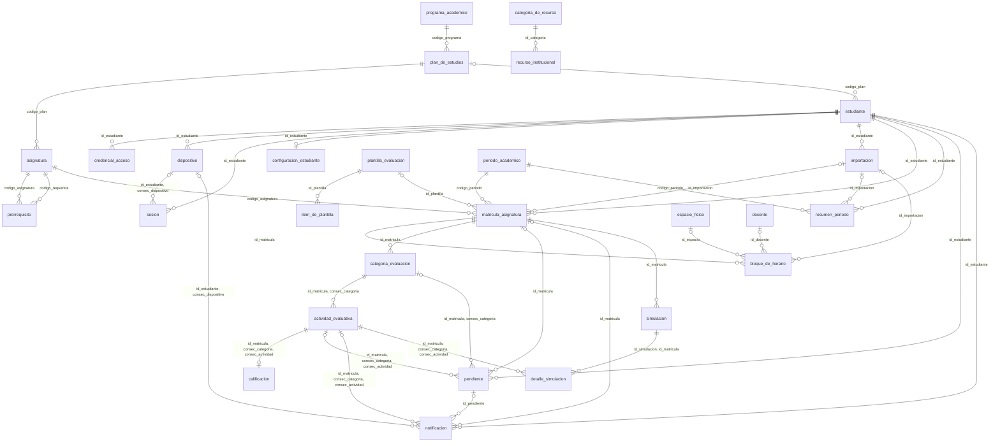

# Modelo de datos de CundiApp

Este documento describe la base de datos que crea la migración `V1__esquema_inicial.sql`: **27 tablas, 204 campos, 40 llaves foráneas, 4 vistas y las 14 restricciones de integridad** del documento del proyecto. Los diagramas de abajo se generan a partir del propio SQL, así que siempre coinciden con lo que existe en la base.

Fuentes: el diccionario de datos del documento V1 (Tabla 14) y las restricciones de integridad de la sección 7.

## Cómo leer los diagramas

- Notación de pata de gallo. `||` significa uno y obligatorio, `|o` cero o uno, `o{` cero o muchos.
- `PK` es llave primaria, `FK` llave foránea y `UK` llave única. Una llave compuesta se marca en cada uno de sus campos.
- Las entidades débiles (`consec_*`) tienen como llave primaria la de su propietaria más un consecutivo que asigna la aplicación (siguiente = máximo actual + 1 dentro del propietario).

## Modelo completo (solo relaciones)




## Detalle por bloques

Los bloques se solapan en unas pocas tablas (mostradas solo con su llave) para que se vea cómo se conectan.

### A. Identidad, plan de estudios y matrícula

```mermaid
erDiagram
    programa_academico ||--o{ plan_de_estudios : "codigo_programa"
    plan_de_estudios ||--o{ asignatura : "codigo_plan"
    asignatura ||--o{ prerrequisito : "codigo_asignatura"
    asignatura ||--o{ prerrequisito : "codigo_requerida"
    plan_de_estudios |o--o{ estudiante : "codigo_plan"
    estudiante ||--o{ credencial_acceso : "id_estudiante"
    estudiante ||--o{ dispositivo : "id_estudiante"
    estudiante ||--o{ sesion : "id_estudiante"
    dispositivo |o--o{ sesion : "id_estudiante, consec_dispositivo"
    estudiante ||--o| configuracion_estudiante : "id_estudiante"
    estudiante ||--o{ importacion : "id_estudiante"
    estudiante ||--o{ matricula_asignatura : "id_estudiante"
    asignatura ||--o{ matricula_asignatura : "codigo_asignatura"
    periodo_academico ||--o{ matricula_asignatura : "codigo_periodo"
    plantilla_evaluacion |o--o{ matricula_asignatura : "id_plantilla"
    importacion |o--o{ matricula_asignatura : "id_importacion"
    estudiante ||--o{ resumen_periodo : "id_estudiante"
    periodo_academico ||--o{ resumen_periodo : "codigo_periodo"
    importacion |o--o{ resumen_periodo : "id_importacion"

    estudiante {
        SERIAL id_estudiante PK
        VARCHAR(20) codigo_plan FK
        VARCHAR(80) nombres
        VARCHAR(80) apellidos
        VARCHAR(120) correo_institucional
        VARCHAR(500) url_foto
        VARCHAR(20) estado_cuenta
        BOOLEAN consentimiento_datos
        TIMESTAMPTZ fecha_consentimiento
        TIMESTAMPTZ fecha_registro
    }

    credencial_acceso {
        INTEGER id_estudiante PK, FK
        VARCHAR(20) proveedor PK
        VARCHAR(255) identificador_externo UK
        VARCHAR(60) hash_contrasena
        VARCHAR(120) correo_proveedor
        BOOLEAN correo_verificado
        TIMESTAMPTZ fecha_vinculacion
        TIMESTAMPTZ fecha_ultimo_acceso
        BOOLEAN activa
    }

    sesion {
        INTEGER id_estudiante PK, FK
        INTEGER consec_sesion PK
        INTEGER consec_dispositivo FK
        VARCHAR(20) proveedor_origen
        VARCHAR(64) hash_token_refresco UK
        TIMESTAMPTZ fecha_inicio
        TIMESTAMPTZ fecha_expiracion
        TIMESTAMPTZ fecha_revocacion
        VARCHAR(40) motivo_revocacion
        VARCHAR(200) user_agent
        VARCHAR(45) ip_origen
    }

    configuracion_estudiante {
        INTEGER id_estudiante PK, FK
        NUMERIC(3,2) meta_calificacion
        NUMERIC(3,2) umbral_riesgo_medio
        NUMERIC(3,2) umbral_riesgo_alto
        INTEGER anticipacion_aviso_horas
        BOOLEAN notificaciones_activas
    }

    dispositivo {
        INTEGER id_estudiante PK, FK
        INTEGER consec_dispositivo PK
        VARCHAR(80) nombre_dispositivo
        VARCHAR(500) endpoint_push
        VARCHAR(120) clave_p256dh
        VARCHAR(60) clave_auth
        TIMESTAMPTZ fecha_sincronizacion
        BOOLEAN activo
    }

    importacion {
        SERIAL id_importacion PK
        INTEGER id_estudiante FK
        VARCHAR(40) tipo_reporte
        VARCHAR(200) nombre_archivo
        TIMESTAMPTZ fecha_carga
        VARCHAR(20) estado_importacion
        INTEGER registros_detectados
        INTEGER registros_confirmados
        VARCHAR(300) mensaje_resultado
    }

    programa_academico {
        VARCHAR(20) codigo_programa PK
        VARCHAR(120) nombre_programa
        VARCHAR(80) facultad
        VARCHAR(60) sede
        INTEGER total_creditos
        INTEGER numero_periodos
    }

    plan_de_estudios {
        VARCHAR(20) codigo_plan PK
        VARCHAR(20) codigo_programa FK
        VARCHAR(20) version
        INTEGER anio_vigencia
        VARCHAR(20) estado_plan
    }

    asignatura {
        VARCHAR(20) codigo_asignatura PK
        VARCHAR(20) codigo_plan FK
        VARCHAR(120) nombre_asignatura
        INTEGER creditos
        VARCHAR(30) tipo_asignatura
        INTEGER periodo_sugerido
    }

    prerrequisito {
        VARCHAR(20) codigo_asignatura PK, FK
        VARCHAR(20) codigo_requerida PK, FK
        VARCHAR(30) tipo_requisito
    }

    periodo_academico {
        VARCHAR(10) codigo_periodo PK
        INTEGER anio
        INTEGER semestre
        DATE fecha_inicio
        DATE fecha_fin
        VARCHAR(20) estado_periodo
    }

    matricula_asignatura {
        SERIAL id_matricula PK
        INTEGER id_estudiante FK, UK
        VARCHAR(20) codigo_asignatura FK, UK
        VARCHAR(10) codigo_periodo FK, UK
        INTEGER id_plantilla FK
        INTEGER id_importacion FK
        VARCHAR(20) codigo_grupo
        VARCHAR(20) prioridad
        VARCHAR(20) estado_matricula
        NUMERIC(3,2) nota_final
        NUMERIC(3,2) nota_habilitacion
        NUMERIC(3,2) nota_definitiva
        VARCHAR(30) fuente_notas
        INTEGER fallas
        TIMESTAMPTZ actualizado_en
    }

    resumen_periodo {
        INTEGER id_estudiante PK, FK
        VARCHAR(10) codigo_periodo PK, FK
        INTEGER id_importacion FK
        INTEGER creditos_matriculados
        INTEGER creditos_aprobados
        NUMERIC(3,2) promedio_periodo
        NUMERIC(3,2) promedio_acumulado
        VARCHAR(30) fuente
    }

    plantilla_evaluacion {
        SERIAL id_plantilla PK
        VARCHAR(80) nombre_plantilla UK
        VARCHAR(200) descripcion
        BOOLEAN es_predeterminada
    }
```

### B. Horario y estructura de evaluación

```mermaid
erDiagram
    plantilla_evaluacion ||--o{ item_de_plantilla : "id_plantilla"
    plantilla_evaluacion |o--o{ matricula_asignatura : "id_plantilla"
    importacion |o--o{ matricula_asignatura : "id_importacion"
    matricula_asignatura ||--o{ bloque_de_horario : "id_matricula"
    espacio_fisico |o--o{ bloque_de_horario : "id_espacio"
    docente |o--o{ bloque_de_horario : "id_docente"
    importacion |o--o{ bloque_de_horario : "id_importacion"
    matricula_asignatura ||--o{ categoria_evaluacion : "id_matricula"
    categoria_evaluacion ||--o{ actividad_evaluativa : "id_matricula, consec_categoria"
    actividad_evaluativa ||--o| calificacion : "id_matricula, consec_categoria, consec_actividad"

    matricula_asignatura {
        SERIAL id_matricula PK
    }

    bloque_de_horario {
        INTEGER id_matricula PK, FK
        INTEGER consec_bloque PK
        INTEGER id_espacio FK
        INTEGER id_docente FK
        INTEGER id_importacion FK
        VARCHAR(15) dia_semana
        TIME hora_inicio
        TIME hora_fin
    }

    docente {
        SERIAL id_docente PK
        VARCHAR(80) nombres
        VARCHAR(80) apellidos
        VARCHAR(160) nombre_normalizado UK
        VARCHAR(120) correo_institucional
    }

    espacio_fisico {
        SERIAL id_espacio PK
        VARCHAR(30) nomenclatura
        VARCHAR(30) bloque
        VARCHAR(60) sede
        VARCHAR(30) tipo_espacio
    }

    importacion {
        SERIAL id_importacion PK
    }

    plantilla_evaluacion {
        SERIAL id_plantilla PK
    }

    item_de_plantilla {
        INTEGER id_plantilla PK, FK
        INTEGER consec_item PK
        VARCHAR(80) nombre_item
        NUMERIC(5,2) porcentaje
    }

    categoria_evaluacion {
        INTEGER id_matricula PK, FK
        INTEGER consec_categoria PK
        VARCHAR(80) nombre_categoria
        NUMERIC(5,2) porcentaje
        VARCHAR(30) origen_categoria
        TIMESTAMPTZ actualizado_en
    }

    actividad_evaluativa {
        INTEGER id_matricula PK, FK
        INTEGER consec_categoria PK, FK
        INTEGER consec_actividad PK
        VARCHAR(120) nombre_actividad
        NUMERIC(5,2) porcentaje
        DATE fecha_programada
        VARCHAR(30) tipo_actividad
        VARCHAR(20) estado_entrega
        TIMESTAMPTZ actualizado_en
    }

    calificacion {
        INTEGER id_matricula PK, FK
        INTEGER consec_categoria PK, FK
        INTEGER consec_actividad PK, FK
        NUMERIC(3,2) nota_obtenida
        TIMESTAMPTZ fecha_registro
        VARCHAR(30) origen_registro
        VARCHAR(300) observacion
        TIMESTAMPTZ actualizado_en
    }
```

### C. Pendientes, simulaciones, avisos y guía institucional

```mermaid
erDiagram
    estudiante ||--o{ dispositivo : "id_estudiante"
    estudiante ||--o{ matricula_asignatura : "id_estudiante"
    estudiante ||--o{ pendiente : "id_estudiante"
    matricula_asignatura |o--o{ pendiente : "id_matricula"
    actividad_evaluativa |o--o{ pendiente : "id_matricula, consec_categoria, consec_actividad"
    estudiante ||--o{ notificacion : "id_estudiante"
    dispositivo |o--o{ notificacion : "id_estudiante, consec_dispositivo"
    pendiente |o--o{ notificacion : "id_pendiente"
    matricula_asignatura |o--o{ notificacion : "id_matricula"
    actividad_evaluativa |o--o{ notificacion : "id_matricula, consec_categoria, consec_actividad"
    matricula_asignatura ||--o{ simulacion : "id_matricula"
    simulacion ||--o{ detalle_simulacion : "id_simulacion, id_matricula"
    actividad_evaluativa ||--o{ detalle_simulacion : "id_matricula, consec_categoria, consec_actividad"
    categoria_de_recurso ||--o{ recurso_institucional : "id_categoria"

    estudiante {
        SERIAL id_estudiante PK
    }

    matricula_asignatura {
        SERIAL id_matricula PK
    }

    actividad_evaluativa {
        INTEGER id_matricula PK, FK
        INTEGER consec_categoria PK, FK
        INTEGER consec_actividad PK
    }

    dispositivo {
        INTEGER id_estudiante PK, FK
        INTEGER consec_dispositivo PK
    }

    pendiente {
        SERIAL id_pendiente PK
        INTEGER id_estudiante FK
        INTEGER id_matricula FK
        INTEGER consec_categoria FK
        INTEGER consec_actividad FK
        VARCHAR(120) titulo
        VARCHAR(300) descripcion
        TIMESTAMPTZ fecha_limite
        VARCHAR(20) prioridad
        VARCHAR(20) estado_pendiente
        TIMESTAMPTZ fecha_creacion
        TIMESTAMPTZ actualizado_en
    }

    notificacion {
        SERIAL id_notificacion PK
        INTEGER id_estudiante FK
        INTEGER consec_dispositivo FK
        INTEGER id_pendiente FK
        INTEGER id_matricula FK
        INTEGER consec_categoria FK
        INTEGER consec_actividad FK
        VARCHAR(40) tipo_notificacion
        VARCHAR(120) titulo
        TEXT mensaje
        TIMESTAMPTZ fecha_programada
        TIMESTAMPTZ fecha_generacion
        TIMESTAMPTZ fecha_envio
        VARCHAR(20) estado_envio
        BOOLEAN leida
    }

    simulacion {
        SERIAL id_simulacion PK, UK
        INTEGER id_matricula FK, UK
        TIMESTAMPTZ fecha_simulacion
        NUMERIC(3,2) meta_utilizada
        BOOLEAN guardada
    }

    detalle_simulacion {
        INTEGER id_simulacion PK, FK, UK
        INTEGER consec_detalle PK
        INTEGER id_matricula FK, UK
        INTEGER consec_categoria FK, UK
        INTEGER consec_actividad FK, UK
        NUMERIC(3,2) nota_hipotetica
    }

    categoria_de_recurso {
        SERIAL id_categoria PK
        VARCHAR(80) nombre_categoria UK
        VARCHAR(200) descripcion
        INTEGER orden
    }

    recurso_institucional {
        SERIAL id_recurso PK
        INTEGER id_categoria FK
        VARCHAR(160) titulo
        VARCHAR(300) descripcion
        VARCHAR(500) url
        VARCHAR(30) tipo_recurso
        VARCHAR(64) hash_contenido
        BOOLEAN requiere_autenticacion
        DATE fecha_publicacion
        DATE fecha_verificacion
        VARCHAR(25) estado_recurso
    }
```

## Restricciones de integridad

Las llaves primarias, foráneas y únicas no bastan para catorce reglas del documento. Así se garantiza cada una:

| N.º | Regla | Cómo se garantiza |
|---|---|---|
| 1 | Las categorías de una matrícula suman exactamente 100 % | Disparador diferido `trg_suma_categorias` |
| 2 | Las actividades de una categoría suman exactamente 100 % | Disparador diferido `trg_suma_actividades` |
| 3 | Los ítems de una plantilla suman exactamente 100 % | Disparador diferido `trg_suma_items` |
| 4 | Estudiante, asignatura y período son únicos en la matrícula | `UNIQUE uk_matricula_estudiante_asignatura_periodo` |
| 5 | Una asignatura no es prerrequisito de sí misma y la cadena no tiene ciclos | `CHECK ck_prerreq_no_a_si_misma` y disparador `trg_prerrequisito_sin_ciclos` |
| 6 | Toda calificación está entre 0.0 y 5.0 | `CHECK ck_calificacion_nota` (y equivalentes en notas de matrícula, resumen y simulación) |
| 7 | La hora de inicio de un bloque es anterior a la de fin | `CHECK ck_bloque_horas` |
| 8 | No hay calificación para una actividad «no entregada» | Disparadores `trg_calificacion_actividad_entregada` y `trg_actividad_con_calificacion` |
| 9 | Toda cuenta conserva al menos un método de acceso activo y cada método es coherente | `CHECK ck_credencial_coherente` y disparadores diferidos `trg_credencial_metodo_activo` y `trg_estudiante_metodo_activo` |
| 10 | El identificador de un proveedor externo no se repite entre cuentas | `UNIQUE uk_credencial_identificador_externo` |
| 11 | La huella del token de refresco es única y una sesión revocada no vuelve a ser vigente ni rota su token | `UNIQUE uk_sesion_hash_token` y disparador `trg_sesion_revocada_inmutable` |
| 12 | Un aviso tiene a lo sumo un origen (pendiente, actividad o asignatura) | `CHECK ck_notificacion_un_solo_origen` |
| 13 | Un pendiente señala una categoría o una actividad solo junto con su matrícula | `CHECK ck_pendiente_origen` y llaves foráneas compuestas |
| 14 | La actividad de una simulación pertenece a la matrícula simulada | Llaves foráneas compuestas `fk_detalle_simulacion` y `fk_detalle_actividad` |

Los disparadores «diferidos» se comprueban al confirmar la transacción, para poder insertar un conjunto completo (por ejemplo las tres categorías de una matrícula) antes de exigir que sume 100 %. Por eso la aplicación debe crear el conjunto entero en una sola transacción.

## Vistas

Lo calculado no se guarda en columnas; sale de estas vistas o del dominio.

| Vista | Qué entrega |
|---|---|
| `v_nota_categoria` | Por categoría de una matrícula: nota parcial de lo calificado, porcentaje ya evaluado y puntos que aporta a la nota final |
| `v_estado_asignatura` | Por matrícula: nota acumulada, porcentaje evaluado y pendiente, nota requerida para llegar a la meta, si la meta es alcanzable y el nivel de riesgo (bajo, medio o alto) según los umbrales del estudiante |
| `v_avance_carrera` | Por estudiante: créditos aprobados sobre el total de su programa y porcentaje de avance |
| `v_sesion_vigente` | Sesiones abiertas de cada estudiante (sin revocar y sin vencer), sin exponer la huella del token |

El cálculo oficial de la nota requerida y del riesgo vive en el dominio (Java) y se prueba sin base de datos; las vistas sirven para consultar y para contrastar el resultado.

## Vocabulario de los campos de estado

Estos son los únicos valores que aceptan los `CHECK` (minúsculas, sin tildes). Se generan del SQL.

| Tabla | Campo | Valores permitidos |
|---|---|---|
| `plan_de_estudios` | `estado_plan` | `vigente`, `cerrado` |
| `asignatura` | `tipo_asignatura` | `obligatoria`, `electiva`, `profundizacion` |
| `prerrequisito` | `tipo_requisito` | `prerrequisito`, `correquisito` |
| `periodo_academico` | `estado_periodo` | `programado`, `en_curso`, `finalizado` |
| `estudiante` | `estado_cuenta` | `pendiente`, `activa`, `inactiva` |
| `credencial_acceso` | `proveedor` | `local`, `google` |
| `sesion` | `proveedor_origen` | `local`, `google` |
| `sesion` | `motivo_revocacion` | `cierre_sesion`, `rotacion`, `reuso_detectado`, `expiracion` |
| `importacion` | `tipo_reporte` | `horario`, `historial`, `plan_de_estudios` |
| `importacion` | `estado_importacion` | `pendiente`, `confirmada`, `revertida`, `fallida` |
| `matricula_asignatura` | `prioridad` | `alta`, `media`, `baja` |
| `matricula_asignatura` | `estado_matricula` | `en_curso`, `aprobada`, `reprobada`, `cancelada` |
| `matricula_asignatura` | `fuente_notas` | `importacion`, `manual` |
| `resumen_periodo` | `fuente` | `importacion`, `manual` |
| `espacio_fisico` | `tipo_espacio` | `aula`, `laboratorio`, `auditorio` |
| `bloque_de_horario` | `dia_semana` | `lunes`, `martes`, `miercoles`, `jueves`, `viernes`, `sabado`, `domingo` |
| `categoria_evaluacion` | `origen_categoria` | `plantilla`, `estudiante` |
| `actividad_evaluativa` | `tipo_actividad` | `parcial`, `taller`, `quiz`, `exposicion` |
| `actividad_evaluativa` | `estado_entrega` | `no_entregada`, `sin_calificar`, `calificada` |
| `calificacion` | `origen_registro` | `estudiante`, `importacion` |
| `pendiente` | `prioridad` | `alta`, `media`, `baja` |
| `pendiente` | `estado_pendiente` | `abierto`, `cumplido`, `vencido` |
| `notificacion` | `tipo_notificacion` | `vencimiento_proximo`, `novedad_registrada`, `cambio_riesgo` |
| `notificacion` | `estado_envio` | `pendiente`, `enviada`, `fallida` |
| `recurso_institucional` | `tipo_recurso` | `documento`, `formato`, `enlace` |
| `recurso_institucional` | `estado_recurso` | `vigente`, `pendiente_revision`, `retirado` |


## Qué cambió respecto a los diagramas de alta resolución

Los diagramas del archivo `Diagramas CundiApp - alta resolucion.zip` (MER de Chen y modelo relacional) corresponden a una versión anterior del modelo: tienen 25 tablas y 165 campos, y el documento V1 define 27 tablas y 204 campos. El esquema sigue el documento. Para dejar los diagramas al día hay que aplicarles esto:

**Tablas que faltan (20 campos):**

- `CREDENCIAL_ACCESO` (9 campos): una fila por método de acceso (contraseña propia o Google) de cada estudiante. Entidad débil de `ESTUDIANTE`.
- `SESION` (11 campos): una fila por sesión abierta, con la huella del token de refresco. Entidad débil de `ESTUDIANTE`, relacionada con `DISPOSITIVO`.

**Campos que cambian en tablas existentes (19 campos):**

| Tabla | Cambio |
|---|---|
| `ESTUDIANTE` | Se agrega `url_foto`; se quita `hash_contrasena` (pasa a `CREDENCIAL_ACCESO`) |
| `CONFIGURACION_ESTUDIANTE` | `umbral_alerta` y `umbral_seguridad` pasan a ser `umbral_riesgo_medio` y `umbral_riesgo_alto` |
| `DISPOSITIVO` | Se agregan `clave_p256dh` y `clave_auth` (suscripción push) |
| `NOTIFICACION` | Se agregan `id_pendiente`, `id_matricula`, `consec_categoria`, `consec_actividad` (origen del aviso) y `fecha_programada` |
| `MATRICULA_ASIGNATURA` | Se agregan `prioridad`, `fuente_notas` y `actualizado_en` |
| `RESUMEN_PERIODO` | Se agrega `id_importacion` |
| `BLOQUE_DE_HORARIO` | Se agrega `id_importacion` |
| `DOCENTE` | Se agrega `nombre_normalizado` |
| `CATEGORIA_EVALUACION`, `ACTIVIDAD_EVALUATIVA`, `CALIFICACION`, `PENDIENTE` | Se agrega `actualizado_en` |
| `DETALLE_SIMULACION` | Se agrega `id_matricula` (garantiza la restricción 14) |
| `RECURSO_INSTITUCIONAL` | Se agregan `hash_contenido` y `estado_recurso`; se quita `vigente` |

En el MER de Chen, además de las dos entidades débiles, faltan las relaciones `ESTUDIANTE` – `CREDENCIAL_ACCESO`, `ESTUDIANTE` – `SESION` y `DISPOSITIVO` – `SESION`, y los tres orígenes posibles de `NOTIFICACION` (`PENDIENTE`, `ACTIVIDAD_EVALUATIVA` y `MATRICULA_ASIGNATURA`).

Los diagramas de este documento ya incluyen todo lo anterior.

## Decisiones de diseño al implementar

Estas decisiones no están escritas en el diccionario y conviene que el equipo las apruebe:

1. **Fechas con zona horaria.** Los campos de fecha y hora son `TIMESTAMPTZ` y no `TIMESTAMP`. Así una misma hora no cambia de valor entre Docker (hora de Bogotá) y Supabase (UTC).
2. **Correo sin distinguir mayúsculas.** La unicidad de `correo_institucional` se hace sobre `lower(correo)`, para que `Ana@...` y `ana@...` no sean dos cuentas.
3. **Estados en texto con `CHECK`.** Se usan `VARCHAR` con lista cerrada de valores, no tipos `ENUM`, para poder agregar un valor con una migración simple.
4. **Consentimiento.** Si `consentimiento_datos` es verdadero, `fecha_consentimiento` es obligatoria. Exigir que sea verdadero al registrarse lo hace el caso de uso de registro.
5. **Derecho al borrado (Ley 1581).** Borrar un estudiante borra en cascada todo lo suyo (credenciales, sesiones, dispositivos, importaciones, matrículas y lo que cuelga de ellas, pendientes y avisos). Los catálogos (programas, planes, asignaturas, períodos) no se tocan.
6. **Pendientes ligados a la estructura de evaluación.** Al borrar una matrícula se borran sus pendientes. Una categoría o una actividad con pendientes asociados no se puede borrar hasta que la aplicación los desvincule (poniendo en `NULL` `consec_categoria` y `consec_actividad`).
7. **Correquisitos.** El control de ciclos solo aplica a los prerrequisitos; dos asignaturas pueden ser correquisito una de la otra.
8. **Valores cortos de estado.** Por el tamaño de las columnas del diccionario (`VARCHAR(20)`), `estado_cuenta` y `estado_importacion` usan `pendiente` y `estado_entrega` usa `sin_calificar`.
