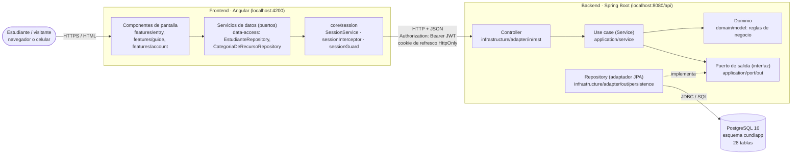
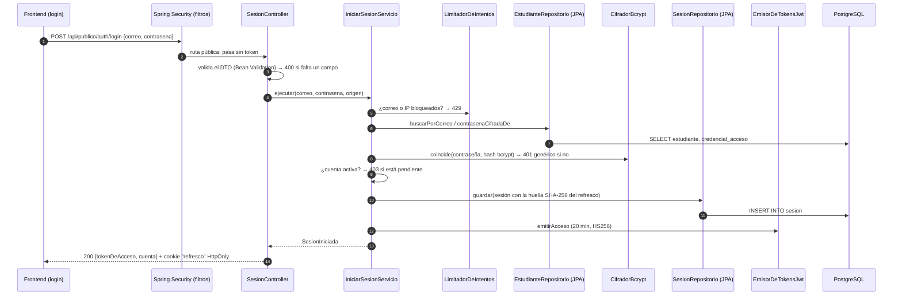

# Arquitectura de CundiApp (lo que está implementado)

Este documento describe solo lo que existe hoy en el código de las ramas `desarrollo` y `produccion` (Review 1). Lo que viene después está marcado como tal.

## 1. Vista general

CundiApp tiene tres piezas que se despliegan por separado y solo se hablan por HTTP o por SQL:

| Pieza | Tecnología | Responsabilidad |
|---|---|---|
| Frontend | Angular 22 (PWA, componentes standalone, señales) | Mostrar y capturar datos. No calcula nada del negocio y nunca habla con la base de datos. |
| Backend | Java 21 + Spring Boot 4, arquitectura hexagonal | Reglas de negocio, seguridad (JWT) y API REST en `/api`. |
| Base de datos | PostgreSQL 16 (Docker en local, Supabase en el ambiente compartido) | Persistencia. El esquema lo crea Flyway (`V1`, `V2`, `V3`); Hibernate solo lo valida. |

**Flujo:** Usuario → Frontend (componente → servicio de datos → interceptor) → API REST (controller → caso de uso → dominio → puerto → adaptador) → PostgreSQL, y la respuesta hace el camino inverso hasta la pantalla.

## 2. Backend: capas

La arquitectura es hexagonal (puertos y adaptadores). Las dependencias apuntan hacia adentro y **ArchUnit lo verifica en cada compilación**: si el dominio importara Spring o JPA, la compilación falla.

| Capa que pide la review | Paquete | Qué hay hoy |
|---|---|---|
| **Controller** | `infrastructure/adapter/in/rest` | `CuentaController`, `SesionController`, `MiCuentaController`, `GuiaController`, DTOs (`record`) y `ManejadorExcepcionesRest` (errores RFC 9457) |
| **Service / UseCase** | `application/port/in` (contrato) y `application/service` (implementación) | `RegistrarEstudiante`, `VerificarCorreo`, `ReenviarCodigoDeVerificacion`, `IniciarSesion`, `RenovarSesion`, `CerrarSesion`, `ConsultarMiCuenta`, `ListarCategoriasDeRecurso` |
| **Dominio** | `domain/model`, `domain/exception` | `Estudiante`, `CorreoInstitucional`, `CodigoDeVerificacion`, `Sesion`, `CategoriaDeRecurso`: las reglas viven aquí, en Java puro |
| **Repository** | `application/port/out` (contrato) y `infrastructure/adapter/out/persistence` (JPA) | `EstudianteRepositorio`, `SesionRepositorio`, `CodigoDeVerificacionRepositorio` y sus adaptadores con Spring Data |
| Otros adaptadores de salida | `infrastructure/adapter/out/{security,clock,notification}` | bcrypt, emisión de JWT, límite de intentos, reloj, envío del código |
| Configuración | `infrastructure/config` | Seguridad, CORS, JWT y ensamblado de los casos de uso como `@Bean` |

Por qué hay un puerto entre el caso de uso y el repositorio: el caso de uso no sabe que existe PostgreSQL. Se prueba con dobles de los puertos (sin base de datos) y el día que cambie el motor solo cambia el adaptador. Es lo que la clase 1 llama *bajo acoplamiento*.

## 3. Flujo de una petición dentro del backend: `POST /api/publico/auth/login`

Los errores del dominio (`CredencialesInvalidasException`, `CuentaNoActivaException`...) no se manejan en el controlador: los traduce `ManejadorExcepcionesRest` a una respuesta `application/problem+json` con el código HTTP correcto, y cada rechazo queda en el log.

## 4. Frontend: componentes y servicios

| Pieza | Archivo | Qué hace |
|---|---|---|
| Pantallas | `features/entry/welcome`, `features/guide/categories`, `features/account/{register,verification,login,my-account}` | Formularios y listas; solo muestran y capturan. Cada una se carga de forma diferida. |
| Servicios de consumo de API | `data-access/*.repository.ts` (contrato) y `data-access/http/*` (HttpClient) | Único lugar que conoce las URLs de la API; salen de `environment.apiUrl`. |
| Sesión | `core/session/session.service.ts` | Guarda el token de acceso **solo en memoria** (nada en localStorage). |
| Interceptor | `core/session/session.interceptor.ts` | Agrega `Authorization: Bearer` a las rutas protegidas y, ante un 401, renueva la sesión una vez. |
| Guardia | `core/session/session.guard.ts` | Impide abrir `/cuenta/mi-cuenta` sin sesión. |

Cómo se comunica con el backend: el componente llama al servicio de datos (`EstudianteRepository.iniciarSesion`), que hace el `HttpClient.post` a la API. El componente nunca usa `HttpClient` directamente: es el mismo patrón de puertos del backend y permite cambiar HTTP por IndexedDB (modo sin conexión, RF12) sin tocar la pantalla.

## 5. Decisiones que se pueden defender en la review

| Tema (clases 1 a 3) | Cómo se cumple |
|---|---|
| Separación de responsabilidades | Controller solo traduce HTTP, el caso de uso orquesta, el dominio decide, el repositorio persiste. |
| Bajo acoplamiento | Puertos (interfaces) entre capas; ArchUnit rompe la compilación si alguien se salta una capa. |
| Config (12 factors) | Nada quemado: `DB_URL`, `DB_PASSWORD`, `JWT_SECRETO`, `CORS_ORIGENES` salen del entorno; en PRE/PROD sin valor por defecto. |
| Backing services | PostgreSQL local (Docker) y Supabase son intercambiables cambiando solo `DB_URL`. |
| Processes (stateless) | La sesión es un JWT; el servidor no guarda estado de usuario en memoria (ver limitación del límite de intentos). |
| Logs | SLF4J a la salida estándar: registro, verificación, inicio y cierre de sesión, rechazos y reutilización de tokens. Nunca correos, contraseñas ni tokens. |
| Frontend desacoplado | URLs desde `environment`, servicios de datos detrás de clases abstractas, sin lógica de negocio. |

## 6. Limitaciones conocidas (se dicen en la review)

- **Límite de intentos en memoria del proceso.** Funciona con un solo backend; si se escalan varias instancias, cada una cuenta aparte. Siguiente paso: llevarlo a la base de datos o a un servicio compartido.
- **El correo no se envía todavía.** En local el código de verificación sale en la consola del backend (`[DEV] Código de verificación para ...`). Falta el adaptador SMTP, que se enchufa en el mismo puerto `EnviadorDeCodigoPort` sin tocar el caso de uso.
- **Guía institucional parcial.** Hoy lista las categorías; buscar, ver vigencia y descargar documentos (SCRUM-19) sigue pendiente.
- **Se presenta en local.** El despliegue en preproducción espera la decisión de hosting y del proveedor de correo.
